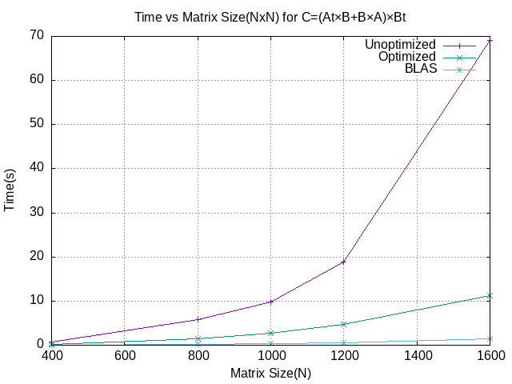

# ASC Tema 3

#### Daraban Albert-Timotei

## Implementare

### BLAS

Am utilizat funcțiile de înmulțire pentru matrici generice/triunghiulare din biblioteca BLAS și două matrici ajutătoare pentru rezultate intermediare.

### Ne-optimizat

Am pornit de la implementarea optimizată. Am calculat sumele părților în variabile marcate register. Am schimbat înmulțirea într-un mod bloc pentru a facilita accesul la cache. Am modificat accesul la memorie de la indexare la lucrul cu pointeri.

### Optimizat

Am pornit de la implementarea optimzata. Am calculat sumele partile in variabile marcate register. Am schimbat inmultire intr un pe blocuri pentru a facilita accesul la cache. Am schimbat accesul de memorie de la in indexi la lucru cu pointeri.

## Results

#### Toate rezultatele sunt de pe partitia ```haswell```

### Grafic



Se observă că încă de la cele mai mici dimensiuni, versiunea neoptimizată este semnificativ mai lentă, iar de la 800 de elemente nu mai are o creștere liniară. Versiunea optimizată își pierde creșterea liniară pe la 1000 de elemente, dar este tot mult mai rapidă. Evident, ATLAS câștigă decisiv cu un timp de aproape 10 ori mai bun la 1600 de elemente. Această performanță cred că se datorează faptului că folosește instrucțiuni SIMD, în timp ce cea optimizată nu.

### Raw results

```
Run=./tema3_blas: N=400: Time=0.026204
Run=./tema3_blas: N=800: Time=0.185223
Run=./tema3_blas: N=1000: Time=0.356111
Run=./tema3_blas: N=1200: Time=0.599831
Run=./tema3_blas: N=1600: Time=1.401712
```

```
Run=./tema3_neopt: N=400: Time=0.667189
Run=./tema3_neopt: N=800: Time=5.807836
Run=./tema3_neopt: N=1000: Time=9.865671
Run=./tema3_neopt: N=1200: Time=18.924393
Run=./tema3_neopt: N=1600: Time=69.081375
```

```
Run=./tema3_opt_m: N=400: Time=0.202658
Run=./tema3_opt_m: N=800: Time=1.429890
Run=./tema3_opt_m: N=1200: Time=4.785307
Run=./tema3_opt_m: N=1000: Time=2.798351
Run=./tema3_opt_m: N=1600: Time=11.314107
```

## Memorie

Am primit o singură eroare ``(Syscall param msync(start) points to uninitialised byte(s))`` la versiunea optimizată, detectată de Valgrind, dar nu cred că are legătură cu implementarea mea (cel mai probabil este pentru că versiunea neoptimizată nu o are).

### Memory usage

```
BLAS: total heap usage: 80 allocs, 80 frees, 9,604,420 bytes allocated
Ne-optimizat: total heap usage: 11 allocs, 11 frees, 8,976,980 bytes allocated
Optimizat: total heap usage: 11 allocs, 11 frees, 8,976,980 bytes allocated
```

Deoarece la versiunea optimizată am pornit de la cea neoptimizată, este aceeași utilizare a memoriei. Interesant este că cea cu BLAS are mai multe alocări, deși în funcția de solver am făcut mai puține alocări decât în celelalte versiuni. Presupun că ATLAS face alocări în propriile funcții.

## Cache

### Instruction cache
```
BLAS: 250,256,366
Ne-optimizat: 5,939,001,351
Optimizat: 2,100,428,199
```

Se observă că folosirea de operații pe pointeri și utilizarea directă a registrelor reduc semnificativ numărul de instrucțiuni între versiunile optimizată și neoptimizată. Cu toate acestea, versiunea BLAS folosește de 8 ori mai puține instrucțiuni, ceea ce mă face să cred că se folosesc instrucțiuni SIMD "la greu".

### Data cache
```
BLAS: 99,118,605
Ne-optimizat: 2,975,700,130
Optimizat: 621,178,932
```

Presupun că folosirea registrelor în loc de variabile de pe stivă a redus din nou numărul de referințe între versiunea optimizată și neoptimizată. Din nou, BLAS este mult mai eficient, datorită naturii instrucțiunilor SIMD pe care le folosește.

### Instruction miss rate
```
BLAS: 0.01%
Ne-optimizat: 0.00%
Optimizat: 0.00%
```

Diferența este insignifiantă. Deoarece instrucțiunile sunt de obicei unele lângă altele, nu prea există ratări. Singurele care apar sunt poate la apelurile de funcții. BLAS pare să aibă mai multe, fiindcă are și mult mai puține instrucțiuni referențiate.

### Data miss rate
```
BLAS: 1.8% (r 1.6% w 3.4%)
Ne-optimizat: 3.8% (r 4.0% w 0.1%)
Optimizat: 3.2% (r 3.3% w 1.1%)
```

Se observă că, chiar și pentru o bibliotecă super optimizată ca și BLAS, rata de ratări a cache-ului este destul de ridicată, natural din natura înmulțirilor de matrici. Între optimizat și neoptimizat, nu este o mare diferență pe toate, lucru care mă face foarte trist. Mare diferență se vede la ratările de scriere. Ceea ce vine de la optimizările de înmulțire pe blocuri.

## Profiler output

```
Each sample counts as 0.01 seconds.
  %   cumulative   self              self     total           
 time   seconds   seconds    calls   s/call   s/call  name    
 48.53     10.90    10.90        5     2.18     2.18  multiply_general
 25.98     16.73     5.83        5     1.17     1.17  multiply_upper_triangular
 25.14     22.37     5.64        5     1.13     1.13  multiply_lower_triangular
  0.27     22.43     0.06       10     0.01     0.01  generate_data
  0.18     22.47     0.04       10     0.00     0.00  transpose
  0.13     22.50     0.03        5     0.01     0.01  add
  0.00     22.50     0.00        5     0.00     4.49  my_solver
  0.00     22.50     0.00        5     0.00     4.50  run_test
  0.00     22.50     0.00        5     0.00     0.00  write_cmat_file
  0.00     22.50     0.00        1     0.00     0.00  read_input_file
```

Acesta este rezultatul pentru versiunea optimizată, dacă rulează cele cinci dimensiuni de matrici `(400, 800, 1000, 1200, 1600)`. Se observă că înmulțirile pe matrici triunghiulare durează aproape jumătate din timp, ceea ce este natural. În timpul dezvoltării programului, înainte să fac înmulțire pe blocuri, și pentru `multiply_upper_triangular` și `multiply_lower_triangular` aveau același timp de execuție ca și `multiply_general`.
